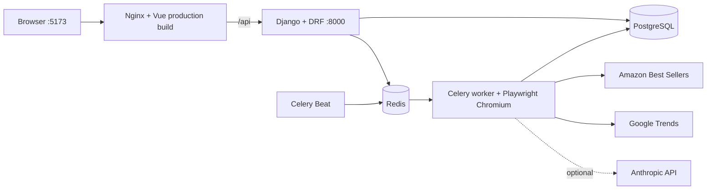

# E-commerce Product Scorer

An MVP for collecting e-commerce product signals, maintaining a catalogue of historically successful products, and producing a transparent product score. The application collects Amazon Best Sellers and Google Trends data with Playwright, applies a deterministic scoring formula, and can optionally ask Anthropic for a text explanation. A Vue dashboard exposes the workflow without making external collection requests block the API.

## Features

- Amazon Best Sellers collection through Playwright, launched manually or every six hours
- Configurable Amazon category targets and product limit per category
- Google Trends collection through Playwright with historical snapshots
- Sales Boost records created manually or imported atomically from CSV
- Deterministic product scoring with preserved analysis history
- Optional Anthropic explanation with deterministic fallback
- Asynchronous `JobRun` lifecycle and counters for collection and analysis jobs
- Vue 3 dashboard with session authentication and job polling
- Dockerized PostgreSQL, Redis, Django, Celery worker, Celery Beat, and Nginx

## Architecture



The frontend is compiled by Vite and served by Nginx. Nginx proxies same-origin `/api/` requests to Gunicorn/Django. The backend image intentionally contains no browser runtime; only the worker image adds Playwright and Chromium. Redis is the Celery broker/result backend, PostgreSQL stores application data, and Beat dispatches the scheduled Amazon collection.

## Data flow

1. Run Amazon collection to create or refresh `Product` records.
2. Run Google Trends collection to append a `TrendSnapshot` for each product.
3. Maintain `SuccessfulProduct` records through the manual form or CSV import.
4. Run product analysis to combine Amazon, the latest Trends snapshot, and Sales Boost signals.
5. Review the latest score and reasoning in the dashboard; prior `ProductAnalysis` rows remain in the database.

Amazon collection, Google Trends collection, and product analysis are independent explicit jobs. A Trends failure does not prevent deterministic analysis; it produces a zero Trends component. In addition to the dashboard button, Celery Beat dispatches Amazon collection every six hours by default.

## Scoring formula

```text
final_score = clamp(
    amazon_score * 0.55
    + trends_score * 0.35
    + sales_boost,
    0,
    100
)
```

All components and the final result use deterministic decimal calculations:

- **Amazon score (0-100):** rating contributes up to 70 points (`rating * 14`). A missing rating uses a neutral 35 points. Reviews contribute up to 30 points using logarithmic normalization, capped at 10,000 reviews: `log10(min(reviews, 10000) + 1) / log10(10001) * 30`. Amazon bestseller rank is not stored, so it is not part of the formula.
- **Trends score (0-100):** the most recent `TrendSnapshot` contributes 40% current interest, 40% average interest, and 20% normalized growth. Growth is clamped to -100..100 and mapped to 0..100. If the stored series is empty, the growth contribution is zero.
- **Sales Boost (0-10):** exact normalized title and category match gives 10 points; exact title gives 7.5. Keyword-token overlap contributes 1.25 points per token up to 4, with a 2-point category bonus when keyword overlap also exists. The boost is bounded and category alone does not score.
- **Missing Trends:** when no snapshot exists, `trends_score` is `0.00`; the remaining components are still calculated normally.

The numeric score is never generated or changed by an LLM.

## Optional LLM explanation

Anthropic is optional. Set `LLM_PROVIDER=anthropic` (or `claude`) and provide your own `LLM_API_KEY` to request an explanation. The deterministic numeric score is passed to the provider as fixed input.

No API key is required for a complete demonstration. The deterministic explanation is used when the provider/key is missing and also after a timeout, provider error, empty response, oversized response, or malformed response. The persisted analysis records the explanation source and provider status.

Relevant variables are `LLM_PROVIDER`, `LLM_API_KEY`, `LLM_MODEL`, and `LLM_TIMEOUT_SECONDS`. Never commit a real key.

## Requirements

- Docker
- Docker Compose v2 (`docker compose`)

Local Python, Node.js, PostgreSQL, Redis, and Chromium installations are not required.

## Quick start

```bash
git clone https://github.com/2DAy1/ecommerce-product-scorer.git
cd ecommerce-product-scorer
docker compose up --build
```

Copying `.env.example` to `.env` is optional because Compose provides safe local-development defaults. Create `.env` only when you want to override them; never commit it.

The initial worker build can take several minutes because it installs Playwright Chromium. When the services are healthy, open:

- Dashboard: <http://localhost:5173>
- Backend health: <http://localhost:18000/api/health/>
- Django admin: <http://localhost:18000/admin/>

Log in with the automatically seeded demo account:

```text
username: demo
password: demo12345
```

The backend waits for healthy PostgreSQL and Redis through Compose dependencies, applies migrations, runs the idempotent demo-user seed command, and then starts Gunicorn. Worker, Beat, and frontend start after the backend is healthy.

## Environment variables

All available examples are in `.env.example`.

### Django and database

- `DJANGO_SECRET_KEY`, `DJANGO_DEBUG`, `DJANGO_ALLOWED_HOSTS`
- `BACKEND_PORT` (default `18000`), `FRONTEND_PORT` (default `5173`)
- `POSTGRES_DB`, `POSTGRES_USER`, `POSTGRES_PASSWORD`, `POSTGRES_HOST`, `POSTGRES_PORT`
- `CELERY_BROKER_URL`, `CELERY_RESULT_BACKEND`, `CELERY_WORKER_CONCURRENCY`
- `DEMO_USERNAME`, `DEMO_EMAIL`, `DEMO_PASSWORD`

### Amazon

- `AMAZON_BEST_SELLERS_URL`: root Best Sellers URL
- `AMAZON_CATEGORIES`: comma-separated Amazon category names or category URLs; blank collects the root Best Sellers page
- `AMAZON_PRODUCTS_PER_CATEGORY`: maximum valid products collected per category
- `AMAZON_REQUEST_TIMEOUT_SECONDS`, `AMAZON_HEADLESS`

### Google Trends

- `TRENDS_GEO`, `TRENDS_PERIOD`
- `TRENDS_REQUEST_TIMEOUT_SECONDS`, `TRENDS_HEADLESS`

### LLM

- `LLM_PROVIDER`: blank for deterministic fallback, or `anthropic`/`claude`
- `LLM_API_KEY`: your optional provider key
- `LLM_MODEL`, `LLM_TIMEOUT_SECONDS`

### Scheduling

- `AMAZON_COLLECTION_INTERVAL_SECONDS`: Beat interval in seconds; default `21600` (six hours)

## Dashboard usage

1. Log in with the demo account or credentials overridden through `DEMO_*`.
2. Use **Collect Amazon** to queue the product collection job.
3. Use **Collect Trends** to queue Google Trends collection after products exist.
4. Add historical winners in Sales Boost manually or upload a CSV.
5. Use **Run analysis** to create a new analysis for every product.
6. Watch the current job card while the dashboard polls its `JobRun` status and counters.
7. Review products, latest scores, reasoning, and signal components in the product table.

The dashboard prevents launching another job while its currently tracked job is active. Beat jobs and jobs opened in other browser sessions remain available through the job-status API but are not automatically discovered by this MVP dashboard.

## Sales Boost CSV format

Uploads must be UTF-8 CSV files no larger than 1 MiB with exactly this header:

```csv
title,category,keywords
Wireless Earbuds,Electronics,wireless;earbuds;audio
Portable Blender,Kitchen,portable;blender;smoothie
```

`title` and `category` are required. `keywords` may be empty; multiple keywords are separated with semicolons. Whitespace is normalized, keyword duplicates are removed case-insensitively, and duplicate rows are rejected by normalized title plus category. A valid file is imported atomically: any invalid row prevents all rows in that upload from being persisted. Re-uploading an existing natural key updates its title and keywords.

## Important API endpoints

| Method | Route | Purpose |
| --- | --- | --- |
| `GET` | `/api/health/` | Public health check |
| `GET` | `/api/auth/session/` | Current session and CSRF cookie |
| `POST` | `/api/auth/login/` | Username/password login |
| `POST` | `/api/auth/logout/` | End the session |
| `GET` | `/api/products/` | Paginated products with latest analysis |
| `GET`, `POST` | `/api/sales-boost/` | List or manually create/update historical winners |
| `POST` | `/api/sales-boost/import/` | Multipart CSV import (`file`) |
| `POST` | `/api/jobs/product-collection/` | Queue Amazon collection |
| `POST` | `/api/jobs/trend-collection/` | Queue Google Trends collection |
| `POST` | `/api/jobs/product-analysis/` | Queue deterministic analysis and optional explanation |
| `GET` | `/api/jobs/<uuid>/` | Read job status, counters, details, and errors |

Except for health and authentication bootstrap routes, application endpoints require an authenticated Django session. Browser writes use Django CSRF protection through the same-origin Nginx proxy.

## Verification

With the Compose project running:

```bash
docker compose exec -T worker python manage.py test
docker compose exec -T worker python manage.py check
docker compose exec -T worker python manage.py makemigrations --check --dry-run
docker compose exec -T worker celery -A config inspect ping
docker compose config --quiet
docker compose build frontend
```

The frontend image build runs both `vue-tsc --noEmit` and the Vite production build. Useful runtime checks:

```bash
docker compose ps
docker compose logs --tail=100 backend worker beat frontend
```

## Design decisions

- **Session auth instead of JWT:** the dashboard and API share one origin, so Django sessions and CSRF provide a smaller, well-tested authentication surface.
- **Deterministic score independent of LLM:** demonstrations and business decisions remain reproducible without a provider key or network availability.
- **Analysis history:** each analysis creates a new `ProductAnalysis`; the products endpoint exposes the latest one without overwriting prior evidence.
- **Atomic CSV import:** invalid Sales Boost input cannot leave a partially imported file.
- **Separate browser worker:** backend and Beat images stay lightweight; the worker alone contains Playwright Chromium for external collection tasks.
- **Database-free Beat schedule:** the six-hour Amazon interval uses the existing Celery configuration without adding a scheduler package or UI.

## Known limitations

- Google Trends can return HTTP 429 depending on the network/environment. The task fails fast, records a failed `JobRun`, and does not leave partial snapshots. A successful live HTTP 200 Trends run was not available from the development environment used for final verification.
- The dashboard tracks jobs launched in the current browser session and displays one active job at a time; it does not provide a global job-history screen.
- A live Anthropic explanation requires the user's own valid API key. Deterministic scoring and reasoning work without it.
- The MVP has no advanced charts, saved filters, or analytics visualizations.
- External Amazon and Google page structures or anti-automation controls can change independently of this repository.

## Repository structure

```text
.
|-- docker-compose.yml
|-- .env.example
|-- backend/
|   |-- config/                 # Django and Celery settings
|   |-- core/                   # health, session auth, demo-user seed
|   |-- catalog/                # products, successful products, CSV import
|   |-- analytics/              # collectors, scoring, snapshots, jobs
|   |-- api/                    # DRF serializers, views, routes, API tests
|   |-- docker/entrypoint.sh    # migrations, seed, Gunicorn startup
|   `-- Dockerfile              # lightweight backend and browser worker targets
`-- frontend/
    |-- src/                    # Vue dashboard and typed API client
    |-- nginx.conf              # static hosting and /api reverse proxy
    `-- Dockerfile              # Vite build and Nginx runtime stages
```
