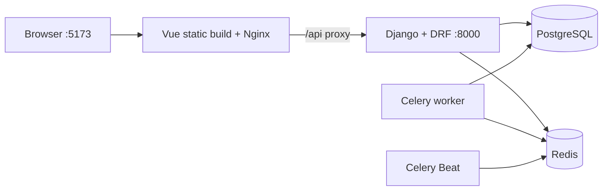

# Parser MVP — infrastructure skeleton

MVP foundation: Django/DRF, Vue 3 + TypeScript, PostgreSQL, Redis, Celery worker, Celery Beat і Docker Compose. Frontend компілюється Vite та віддається Nginx. Scraping і scoring поки не реалізовані.

## Архітектура



## Структура

```text
.
├── docker-compose.yml
├── .env.example
├── backend/
│   ├── Dockerfile
│   ├── requirements.txt
│   ├── manage.py
│   ├── docker/entrypoint.sh
│   ├── config/                 # Django + Celery configuration
│   ├── core/                   # healthcheck and demo-user seed command
│   ├── catalog/                # products and successful products
│   └── analytics/              # trends, analyses and job runs
└── frontend/
    ├── Dockerfile
    ├── nginx.conf
    ├── package.json
    ├── vite.config.ts
    └── src/                    # minimal Vue shell
```

## Запуск

```bash
docker compose up --build
```

Копіювати `.env.example` не обов'язково: Compose має development defaults. Для власних значень створіть `.env` поруч із `docker-compose.yml`.

- Frontend: http://localhost:5173
- Backend healthcheck: http://localhost:18000/api/health/
- Django admin: http://localhost:18000/admin/
- Demo admin: `demo` / `demo12345` (або значення `DEMO_*` із `.env`)

## Startup sequence

1. PostgreSQL і Redis стартують та проходять власні healthchecks.
2. Backend виконує всі Django migrations.
3. Команда `seed_demo_user` ідемпотентно створює або синхронізує development superuser для Django admin.
4. Gunicorn запускає Django; Compose перевіряє `/api/health/`.
5. Після готовності backend запускаються окремі контейнери Celery worker і Celery Beat.
6. Frontend запускає Nginx зі статичним Vue production build і проксіює `/api/` у backend-контейнер.

Beat уже підключений до Redis, але його schedule порожній до появи бізнес-задач.

## Залежності

Backend:

- Django — framework, ORM, auth і migrations.
- Django REST Framework — HTTP API.
- psycopg — PostgreSQL driver.
- Celery з Redis extra — worker, Beat і Redis transport.
- Gunicorn — WSGI server.

Frontend:

- Vue — UI framework.
- Vite та офіційний Vue plugin — production build.
- TypeScript і vue-tsc — типізація та перевірка Vue SFC.
- Nginx — мінімальний production runtime і reverse proxy для `/api/`.

Навмисно відсутні Axios, Vue Router, Pinia, CORS middleware, dotenv wrappers і окремий database scheduler для Beat.

## Перевірка

```bash
docker compose config
docker compose ps
curl http://localhost:18000/api/health/
curl http://localhost:5173/api/health/
docker compose exec backend python manage.py check
docker compose exec backend python manage.py test
docker compose exec backend python manage.py showmigrations
docker compose exec backend python manage.py shell -c "from django.contrib.auth import get_user_model; print(get_user_model().objects.filter(username='demo').exists())"
docker compose exec worker celery -A config inspect ping
docker compose logs beat
docker compose exec frontend nginx -t
```

Frontend production build виконується під час Docker build. Chromium доступний лише у worker image і може бути перевірений так:

```bash
docker compose exec -T worker python -c "from playwright.sync_api import sync_playwright; p=sync_playwright().start(); b=p.chromium.launch(); print(b.version); b.close(); p.stop()"
```

## Migrations, seed і Celery

`backend/docker/entrypoint.sh` послідовно запускає `migrate --noinput`, `seed_demo_user`, а потім замінює shell-процес на Gunicorn через `exec`. Seed безпечний для повторних запусків: користувач не дублюється, а email, пароль і активний статус синхронізуються зі змінними середовища.

Backend і Beat використовують легкий `backend` target без Chromium. Worker збирається з окремого `worker` target, який додає Playwright та Chromium поверх спільного Python/Django шару. Усі три працюють в окремих контейнерах; worker і Beat стартують тільки після healthy-стану backend. Broker — Redis database `0`, result backend — Redis database `1`.
